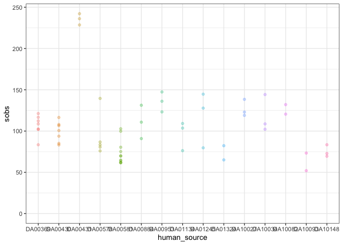
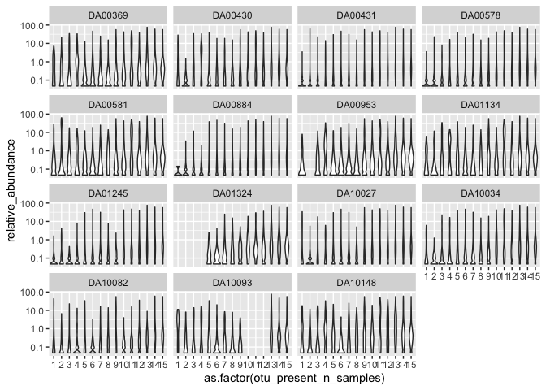
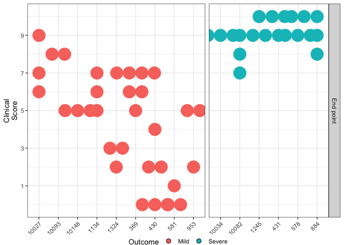
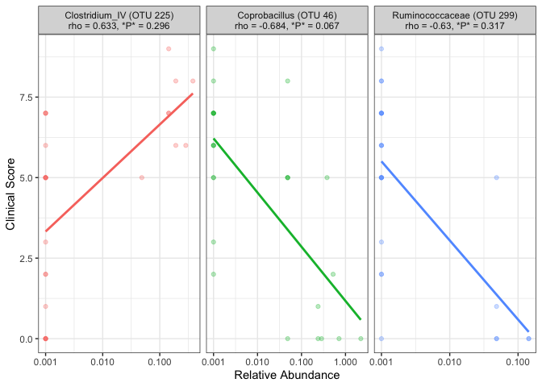
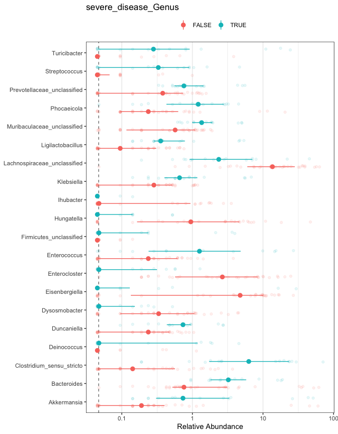
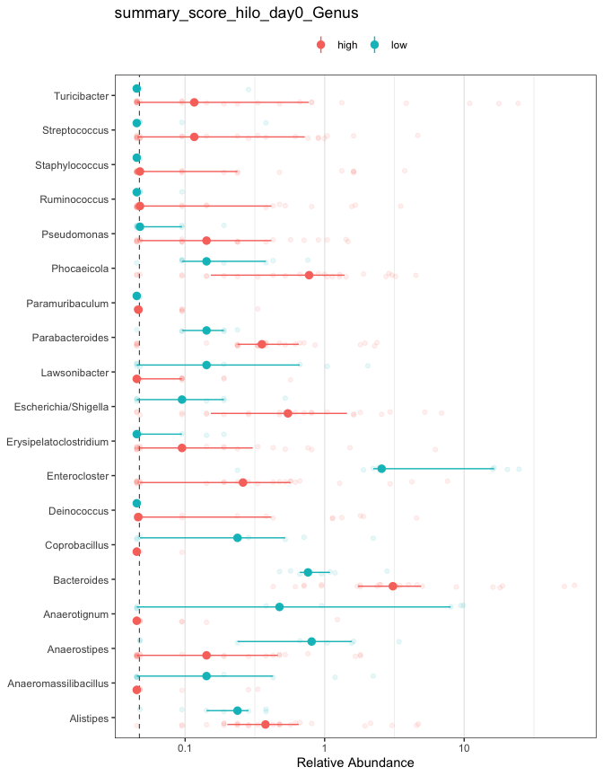
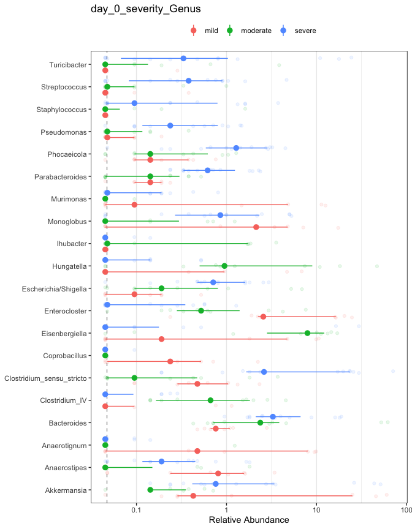
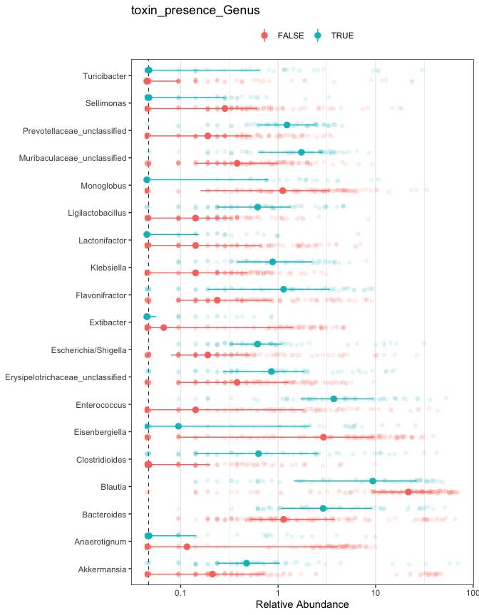
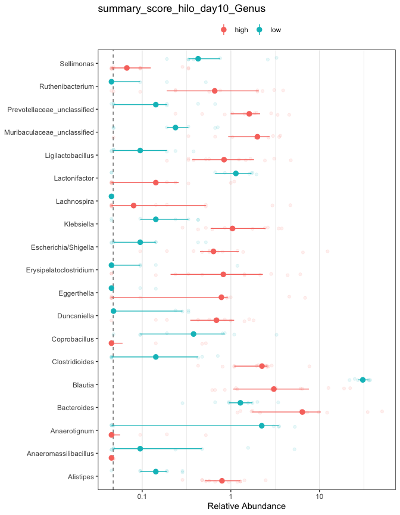

initial\_analysis\_notebook
================
Nick Lesniak
4/13/2021

### Process sequencing data

  - removed unused fastq files

### run fastqs through mothur

    ## [1] "NP2_2630D7 (23 seqs), OP_931D1 (24 seqs), OP_931D3 (24 seqs), NP2_983D3 (25 seqs), NP2_983D1 (36 seqs), NP2_983D2 (49 seqs), CON3_NT_D5 (62 seqs), NP2_983D4 (76 seqs), NP2_2630D1 (90 seqs), NP1_2725D7 (103 seqs), OP_931D0 (116 seqs), NP2_2630D3 (126 seqs), 578_984D0 (130 seqs), 430_304D10 (403 seqs), NP2_979D7 (473 seqs), IN2_2673_D9 (598 seqs), NP2_2630D0 (921 seqs), OP_931D2 (990 seqs), OUTA_2063_D6 (1184 seqs), NP1_2597D6 (1215 seqs), 369_992D10 (1247 seqs), CON3_NT_D4 (1390 seqs), OUT2_2510_D2 (1476 seqs), CON2_2328_D2 (1541 seqs), 578_984D2 (1720 seqs)"

subsampled to 2017, eliminating the 25 samples listed above with their
counts error rate for the data was 0.19%

# Figure 1 - Human communities reporducibly colonize mice

Sampled spread of diverse donors for inoculating germ-free mice

Unique communities without conserved structure
<!-- -->

Unsure about alpha plots

<!-- --><!-- --><!-- -->

<!-- -->

# Figure 2 - Mice were colonized without any perturbation

DA00581 is made up of 4 cages, and at day 1 we see 1 cage at \~10^7.5, 2
cages just above 10^5 and 1 cage at 0. For the cage at 0 there are three
mice, one remains at 0, the other two have transient low appearance of
cdiff as seen below

<!-- -->

Points are added to allow identification of individuals. Here we see one
mouse has low cfu on days 6 and 7, another mouse on day 10.

# Figure supplemental - weight loss

<!-- -->

> NAs on Day 0 for DA01134, DA10034, DA00884  
> Last samples for moribund mice is from cecum

# Figure 3 - Difference in severity

What is toxin distribution by outcome?

<!-- --><!-- -->

    ## # A tibble: 1 x 1
    ##    pvalue
    ##     <dbl>
    ## 1 0.00306

    ## # A tibble: 1 x 1
    ##          pvalue
    ##           <dbl>
    ## 1 0.00000000296

Mice were challenged with a strain isolated that matched Clostridioides
difficile ribotype 027

> what is published about histology of 027 in C57/B6 mice?  
> how much variation is there in individual isolates of RT027?
> RT027/BI/NAP1, toxinotype III VPI 10463 is ribotype 087, toxinotype 0

<!-- -->
Expected correlation, since no cfu == no toxin, and cfu when greater
popultion will produce more toxin

Did not calculation correlation for toxin/clinical score since toxin
only detected in 5 of 53 (with high clinica score) however within range
of others with similar clinical score and no toxin and bias in number of
samples w/o toxin  
Correlations between CFU and histology score not significant.

Same day toxin vs Genus

<!-- -->

Correlation of day 0 otus with day 10 histology scores

<!-- -->

Correlation of day 10 otus with histology scores

<!-- -->
\`\`\`

### LEfSe

#### day 0 prediction of future

<!-- --><!-- --><!-- --><!-- -->

#### same day

<!-- --><!-- -->

What is the genus Clostridioides made up of? Only stool? toxin + disease
mild = limited access to epithelial

Microbe-microbe Interactions during Clostridioides difficile Infection
Arwa Abbas and Joseph P. Zackular. Curr Opin Microbiol. 2020 Feb; 53:
19–25. doi: 10.1016/j.mib.2020.01.016

    C. difficile infection (CDI) can cause a spectrum of disease from mild diarrhea to severe complications such as pseudomembranous colitis, toxic megacolon and death (reviewed in [3]). This broad spectrum of C. difficile-associated disease may be explained in part by bacterial genetic factors such as variation in the pathogenicity locus [4] and increased accessory gene content [5,6]. There is also likely a strong role for exogenous factors such as host genetics, comorbidities, treatment modalities and previous drug exposures. Here we focus on how resident microbiota can manipulate pathogen behavior and virulence.
        competition for essential nutrients, limiting access to mucosal surfaces, direct production of antimicrobial molecules, modulating the intestinal metabolome, and activating the host immune system against the pathogen of interest
    Exposure to low concentrations of deoxycholate, one of the most abundant cecal bile acids [39,40], reduced toxin production by most strains, without a concomitant reduction in general vegetative cell growth 
    B. thetatiotaomicron cross-feeds sialic acid to C. difficile
    succinate appears necessary for C. difficile expansion in the gut
    inhibit via production of bile acids, antibiotics, acidification
    lacto-conditioned media reduce toxin and ability to adhere to host cells
    Enterobacteriaceae and Enterococcus are known to thrive during intestinal inflammation and during CDI 
    Cdiff induces indole production via E. coli which inhibits anaerobes
    Cdiff ferments tyrosine to p-cresol
    C. difficile can also secrete proline-based cyclic dipeptides that can inhibit gut bacteria, including commensal Clostridium species

microbiome/Cdifficile/host interactions lactobacillus inhibits cdiff
biofilm can protect cdiff microbiome can secrete inhibitory compounds -
turbomycin, lantibiotics microbiome can cross feed microbiome via sialic
acid/succinate or even proline or AAs cdiff can inhibit microbiome w/
indole or para-cresol
