initial\_analysis\_notebook
================
Nick Lesniak
4/13/2021

### Process sequencing data

  - removed unused fastq files

### run fastqs through mothur

    ## [1] "NP2_2630D7 (23 seqs), OP_931D1 (24 seqs), OP_931D3 (24 seqs), NP2_983D3 (25 seqs), NP2_983D1 (36 seqs), NP2_983D2 (49 seqs), CON3_NT_D5 (62 seqs), NP2_983D4 (76 seqs), NP2_2630D1 (90 seqs), NP1_2725D7 (103 seqs), OP_931D0 (116 seqs), NP2_2630D3 (126 seqs), 578_984D0 (130 seqs), 430_304D10 (403 seqs), NP2_979D7 (473 seqs), IN2_2673_D9 (598 seqs), NP2_2630D0 (921 seqs), OP_931D2 (990 seqs), OUTA_2063_D6 (1184 seqs), NP1_2597D6 (1215 seqs), 369_992D10 (1247 seqs), CON3_NT_D4 (1390 seqs), OUT2_2510_D2 (1476 seqs), CON2_2328_D2 (1541 seqs), 578_984D2 (1720 seqs)"

subsampled to 2017, eliminating the 25 samples listed above with their
counts error rate for the data was 0.19%

# Figure 1 - Human communities reporducibly colonize mice

Sampled spread of diverse donors for inoculating germ-free mice

Unique communities without conserved structure
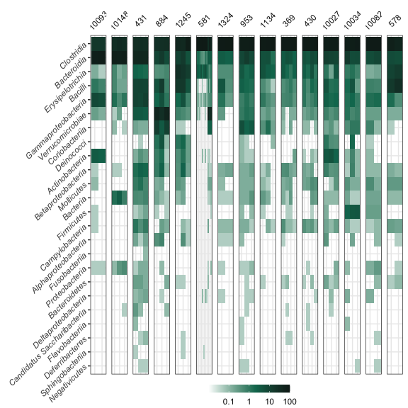<!-- -->

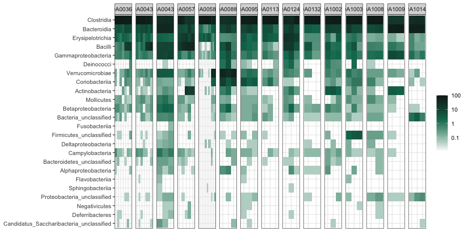<!-- -->

<!-- -->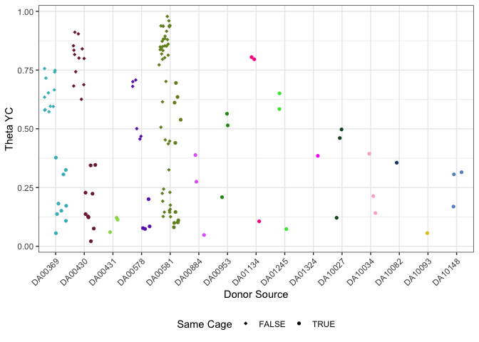<!-- -->

# Figure 2 - Mice were colonized without any perturbation

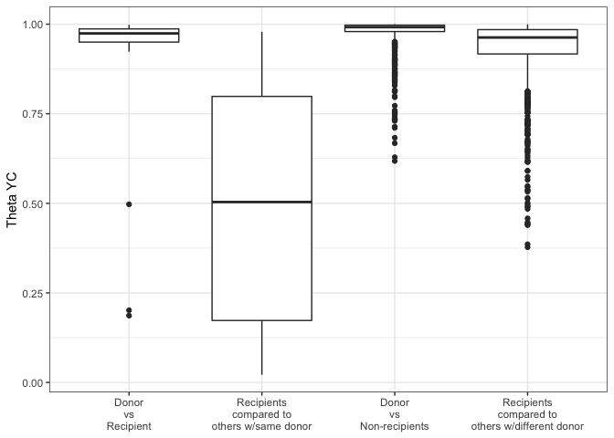<!-- -->
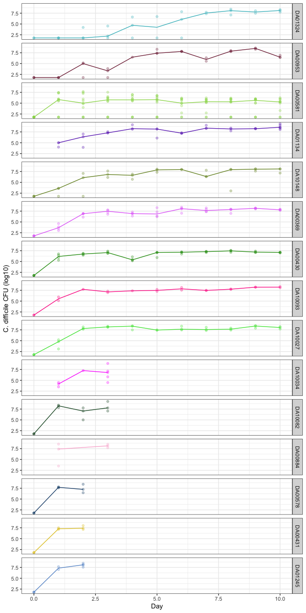<!-- -->

DA00581 is made up of 4 cages, and at day 1 we see 1 cage at \~10^7.5, 2
cages just above 10^5 and 1 cage at 0. For the cage at 0 there are three
mice, one remains at 0, the other two have transient low appearance of
cdiff as seen below

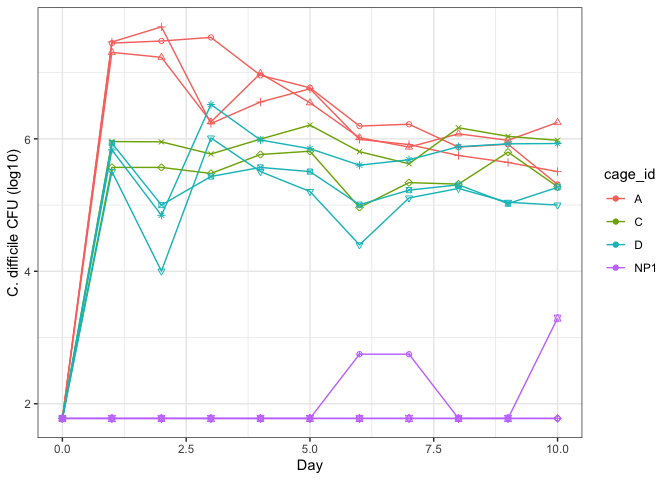<!-- -->

Points are added to allow identification of individuals. Here we see one
mouse has low cfu on days 6 and 7, another mouse on day 10.

# Figure supplemental - weight loss

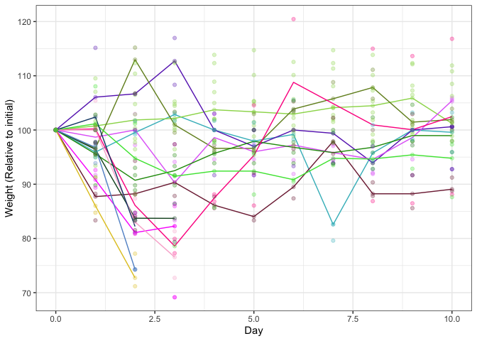<!-- -->

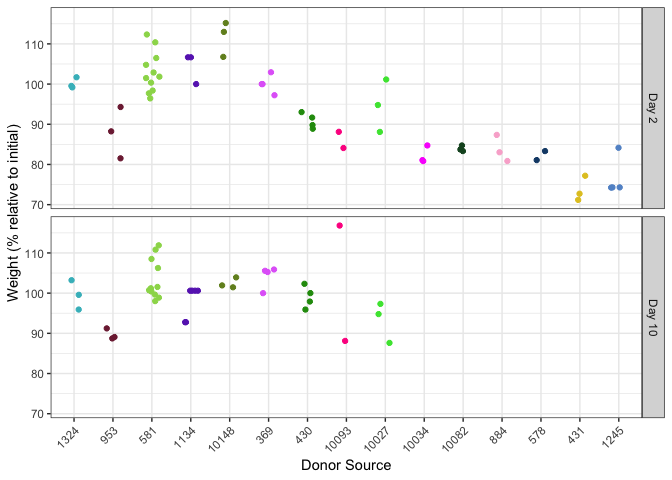<!-- -->

> NAs on Day 0 for DA01134, DA10034, DA00884  
> Last samples for moribund mice is from cecum

# Figure 3 - Difference in severity

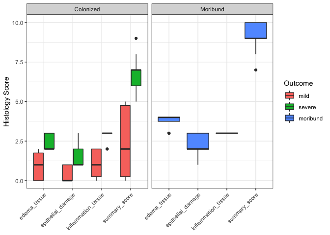<!-- -->

> **Splitting by mean epithelial damage for donor \< 1 = 12 mild, 15
> severe, 17 moribund**  
> Splitting of median summary score of 5 = 10 mild, 11 severe, 17
> moribund  
> (6 have a summary score of 5)  
> Splitting of mean summary score of 4.4 = 10 mild, 17 severe, 17
> moribund

What is toxin distribution by outcome?

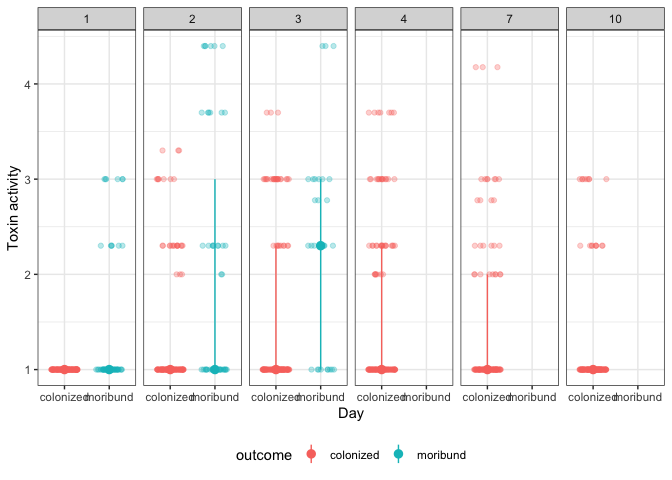<!-- -->

## Can we use toxin to split severity?

do mice split into +/- toxin based on outcome of moribund/mild/severe?

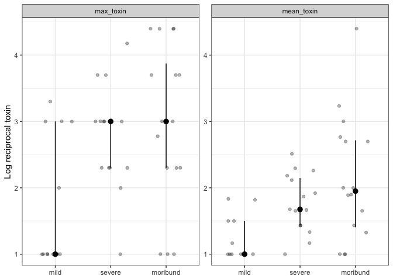<!-- -->

Mice were challenged with a strain isolated that matched Clostridioides
difficile ribotype 027

> what is published about histology of 027 in C57/B6 mice?  
> how much variation is there in individual isolates of RT027?
> RT027/BI/NAP1, toxinotype III VPI 10463 is ribotype 087, toxinotype 0

<!-- -->

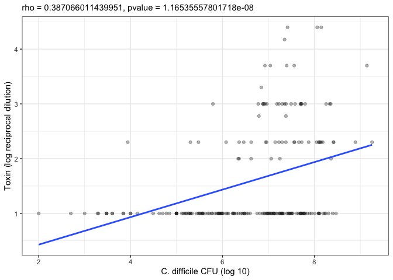<!-- -->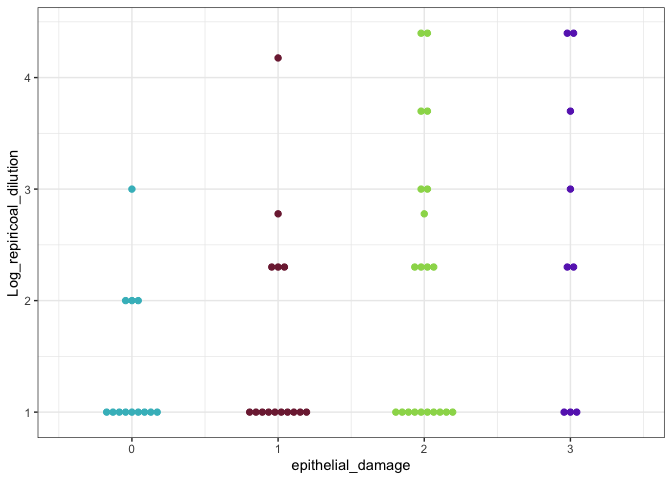<!-- --><!-- --><!-- -->
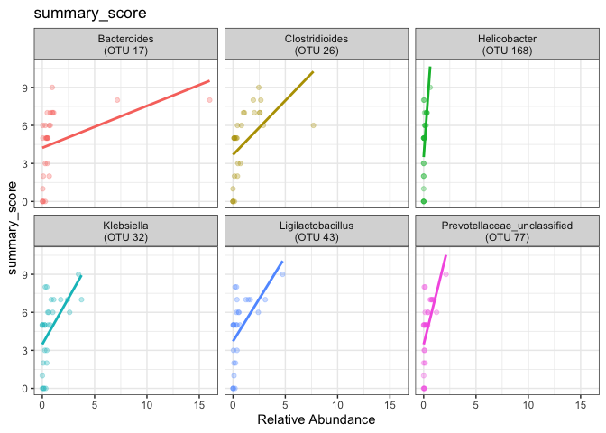<!-- --><!-- -->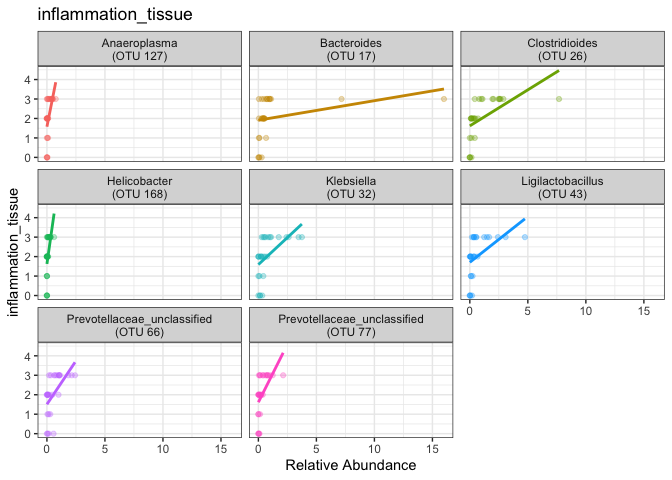<!-- -->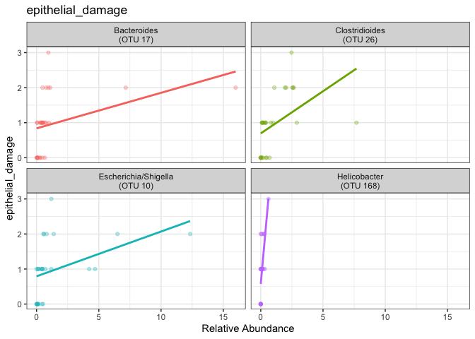<!-- -->

## Severe disease

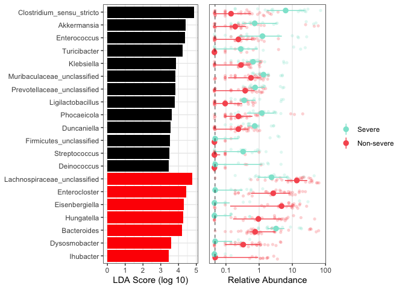<!-- -->

## Toxin presence

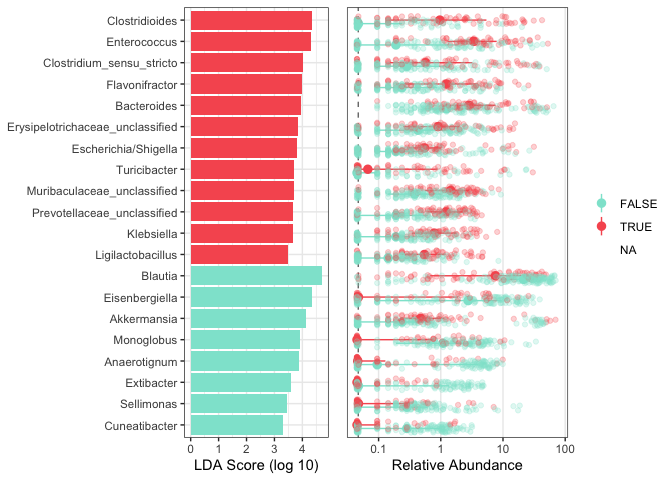<!-- -->

## Summary score

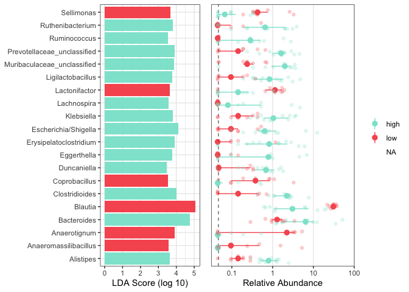<!-- -->

## Epithelial damage

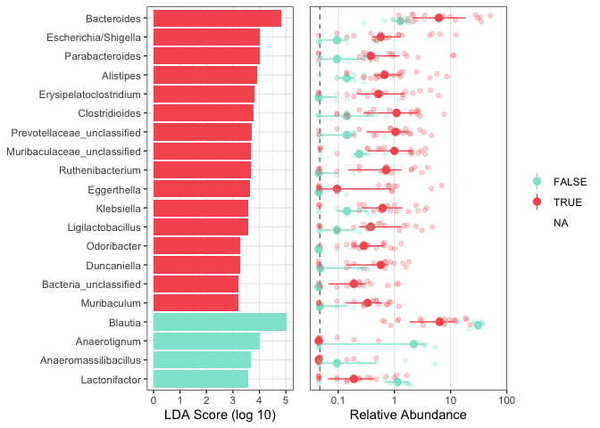<!-- -->
