ml\_output\_notebook
================
Nick Lesniak
5/21/2021

## Hyperparameter Performance

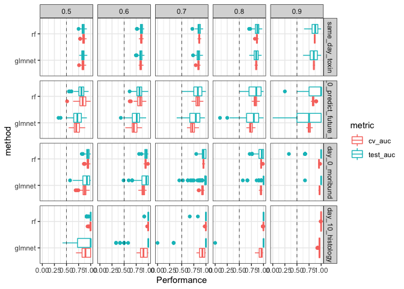<!-- -->

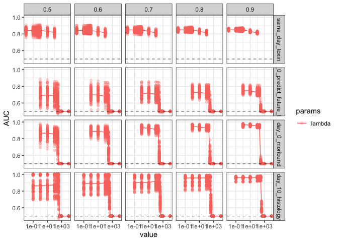<!-- -->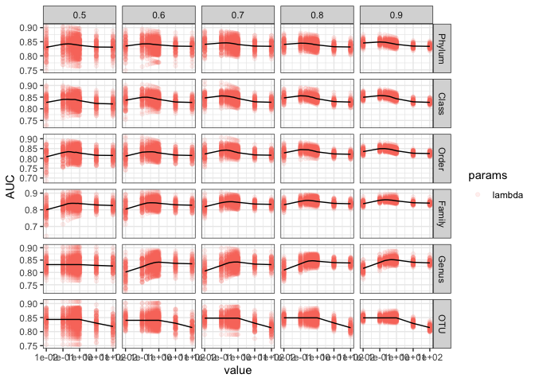<!-- -->

## Model Performance

Features  
\- same day toxin presence - CFU, taxonomic abundances  
\- day 0 future toxin presence - taxonomic abundances  
\- day 0 future moribund - median cfu, day w/toxin presence (prior to
day 3), taxonomic abundances  
to avoid duplicating similar data, i sumarized cfu/toxin to be a single
feature to represent the amount or presence over the first two days of
challenge since all mice were present for at least 2 days - day 10
histology (high/mid/low) - cfu, toxin level, taxonomic abundances

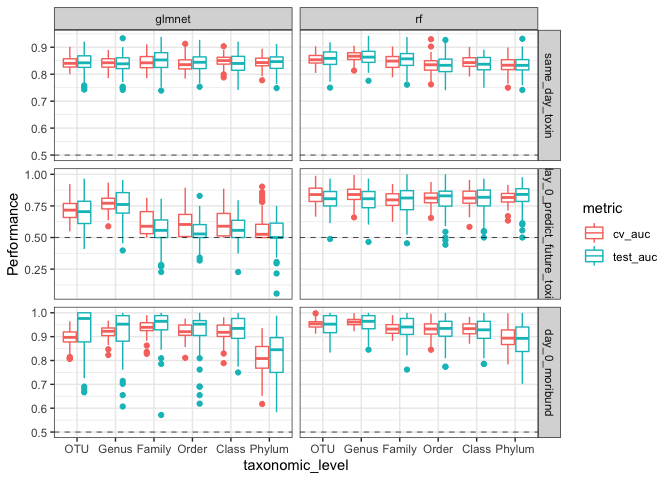<!-- -->

<!-- -->

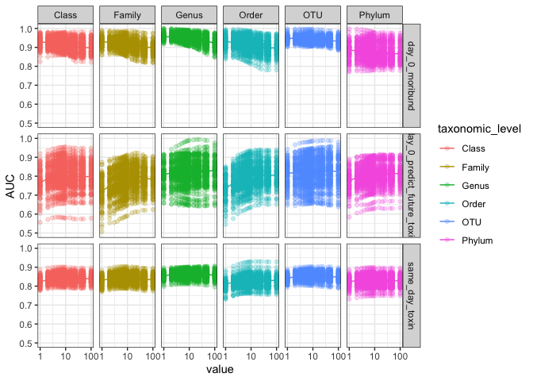<!-- -->

## Models and features

#### Modeling future production of toxin based on initial community

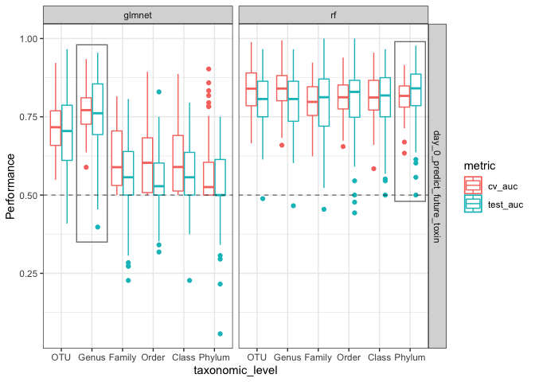<!-- -->

Using Logistic regression at the Genus level or RF at the Phylum level
the features with median differences greater than 0 are:

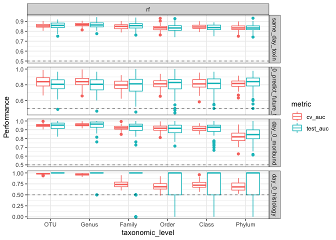<!-- -->

#### Modeling production of toxin with the community and CFU data from that same day

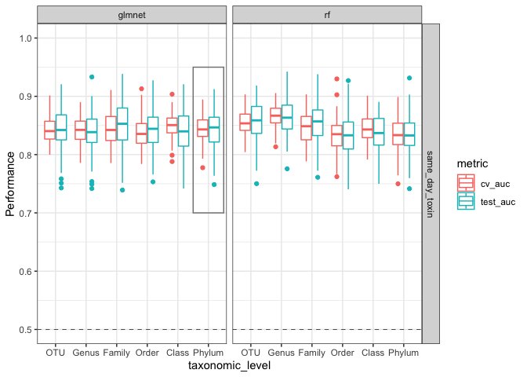<!-- -->

Using Logistic regression at the Phylum level the features with median
differences greater than 0 are:

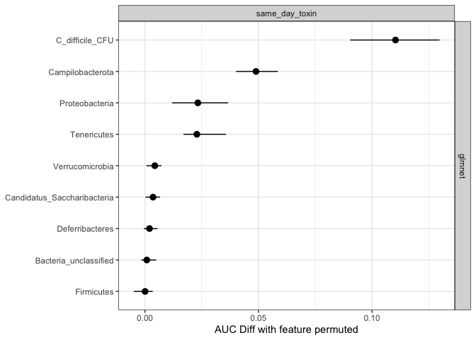<!-- -->

#### Modeling severe disease (moribund) from the initial community

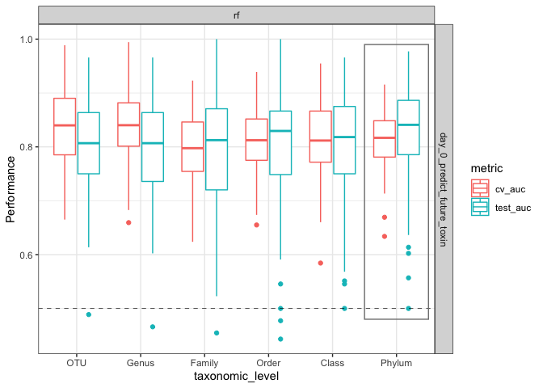<!-- -->

Using Logistic regression at the Class level the features with median
differences greater than 0 are:

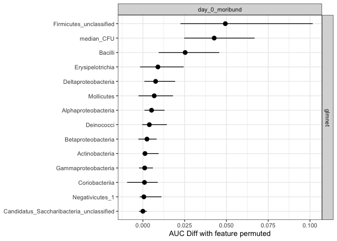<!-- -->

#### Modeling endpoint histology scores

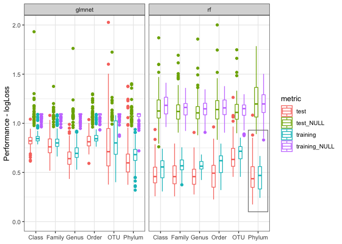<!-- -->

Using multiclass RF at the Phylum level the features with median
differences greater than 0 are:

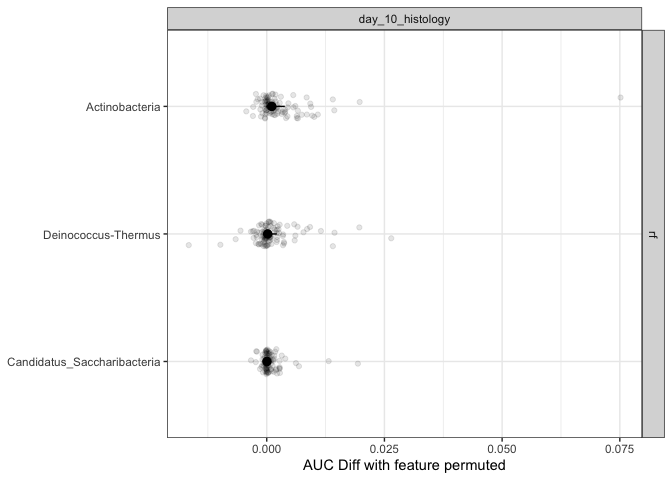<!-- -->
