ml\_output\_notebook
================
Nick Lesniak
5/21/2021

## Hyperparameter Performance

#### Same day toxin

<!-- --><!-- -->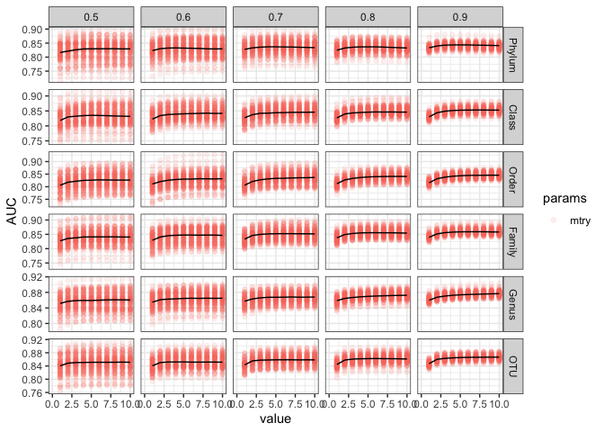<!-- -->

#### Day 0 predict future toxin

<!-- -->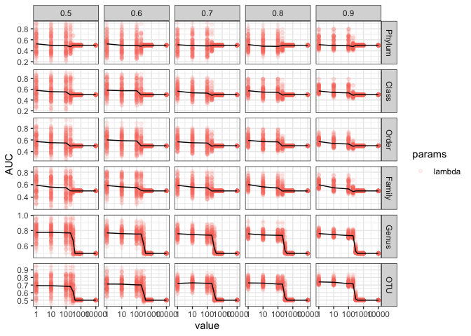<!-- -->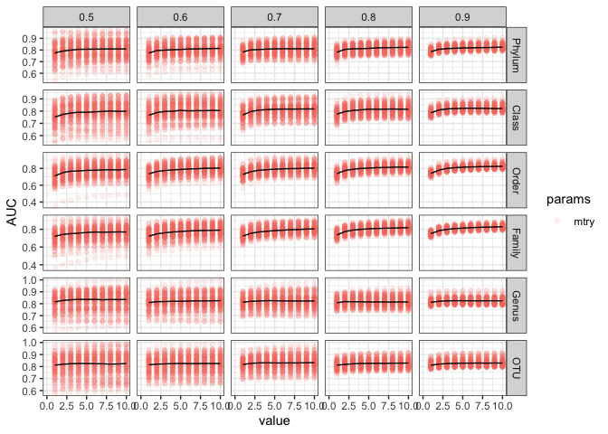<!-- -->

#### Day 0 predict moribund outcome

<!-- -->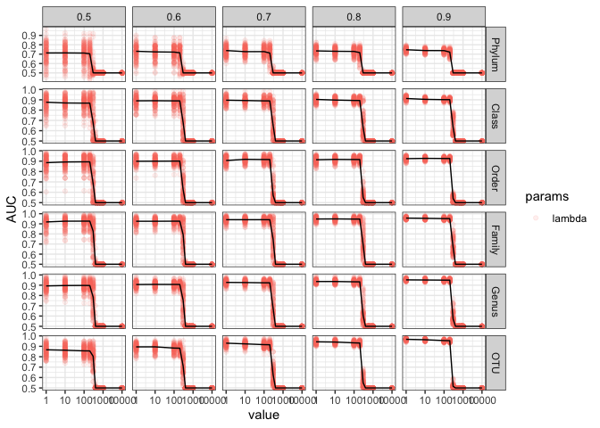<!-- -->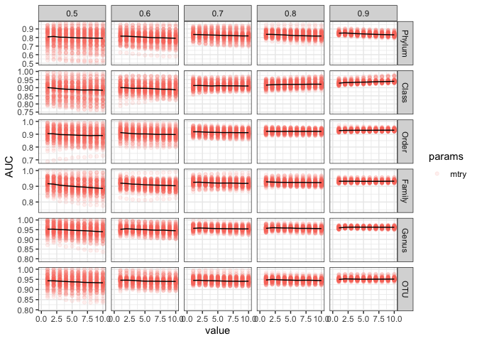<!-- -->

#### Day 0 predict high/low clinical score on day 10

<!-- -->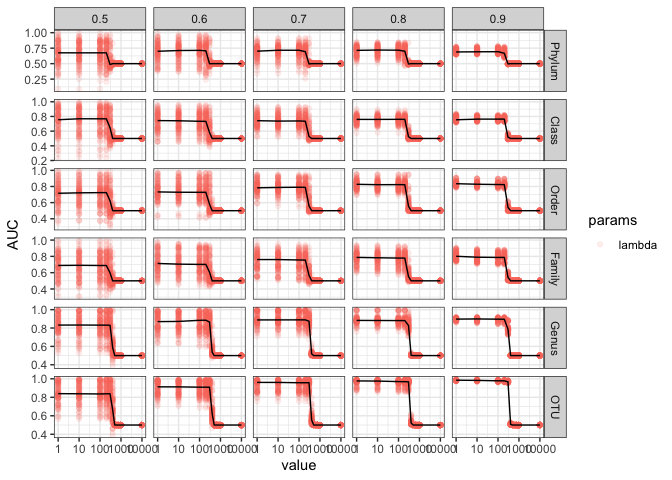<!-- -->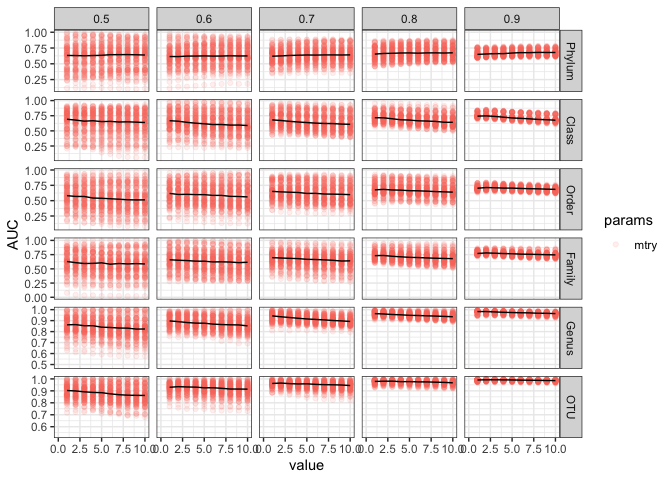<!-- -->

## Model Performance

Features  
\- same day toxin presence - CFU, taxonomic abundances  
\- day 0 future toxin presence - taxonomic abundances

  - day 0 future moribund - median cfu, day w/toxin presence (prior to
    day 3), taxonomic abundances  
  - to avoid duplicating similar data, i sumarized cfu/toxin to be a
    single feature to represent the amount or presence over the first
    two days of challenge since all mice were present for at least 2
    days  
  - day 0 histology (high vs low) - median cfu, days w/toxin, taxonomic
    abundances

<!-- -->

<!-- -->

## Models and features

#### Modeling future production of toxin based on initial community

<!-- -->

Using Logistic regression at the Genus level or RF at the Phylum level
the features with median differences greater than 0 are:

#### Modeling production of toxin with the community and CFU data from that same day

<!-- -->

Using Random Forest at the Phylum level the features with median
differences greater than 0 are:

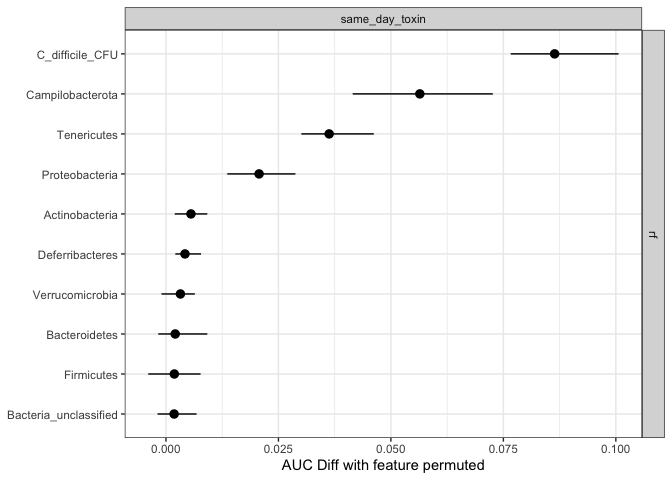<!-- -->

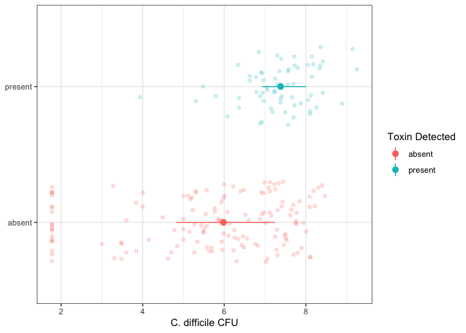<!-- -->

#### Modeling severe disease (moribund) from the initial community

<!-- -->

Using random forest at the Class level the features with median
differences greater than 0 are:

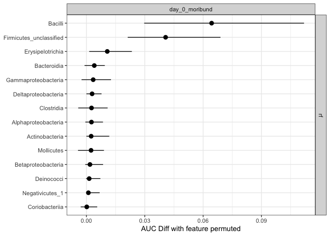<!-- -->

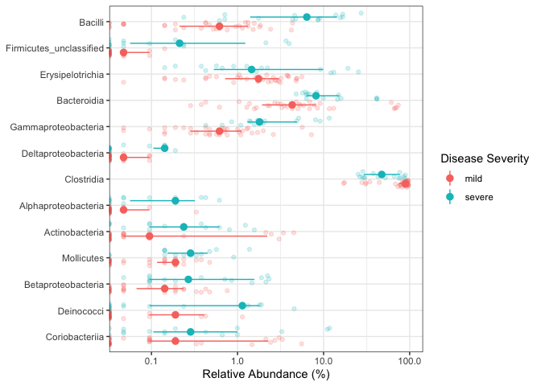<!-- -->

#### Modeling endpoint histology scores

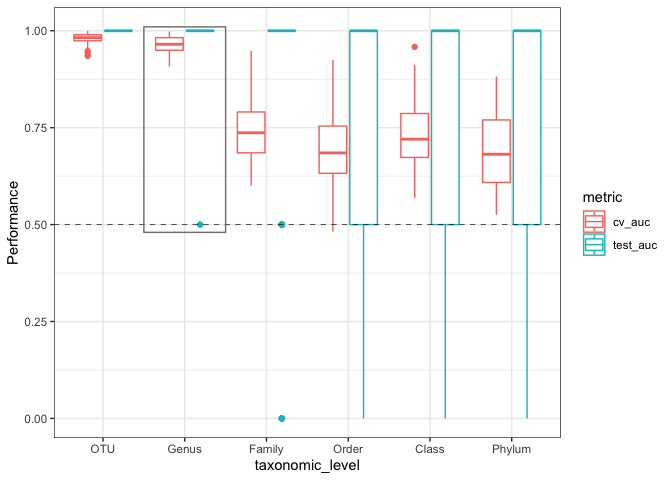<!-- -->

Using Logistic regression at the Class level the features with median
differences greater than 0 are:

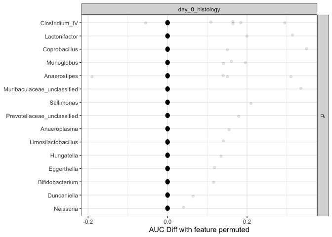<!-- -->

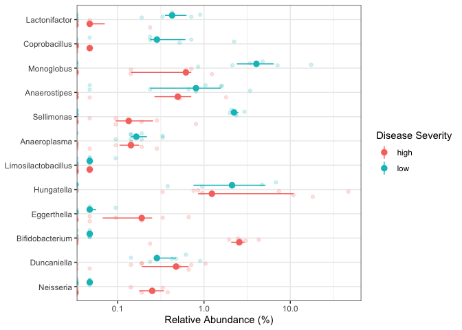<!-- -->

<!-- --><!-- -->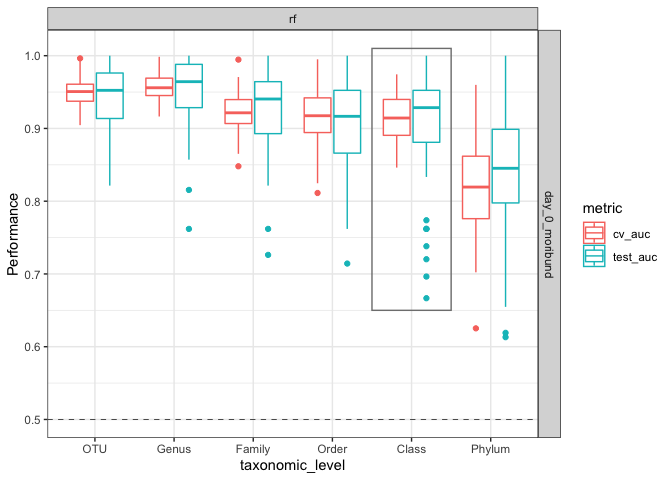<!-- -->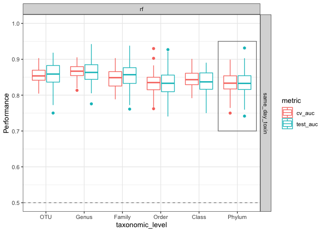<!-- -->

## What are the temporal dynamics of the taxa identified in the Lefse/RF models?

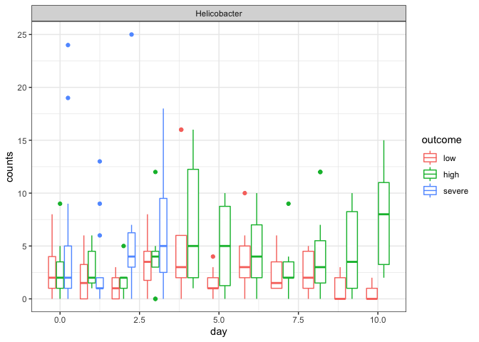<!-- -->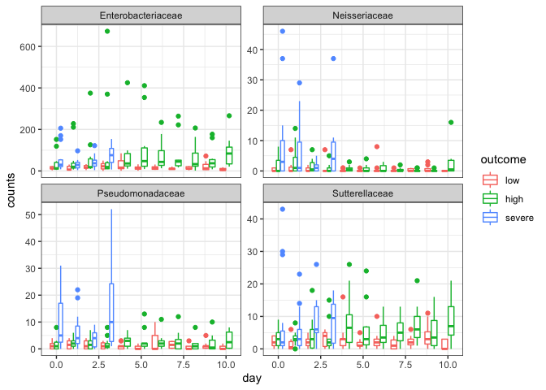<!-- -->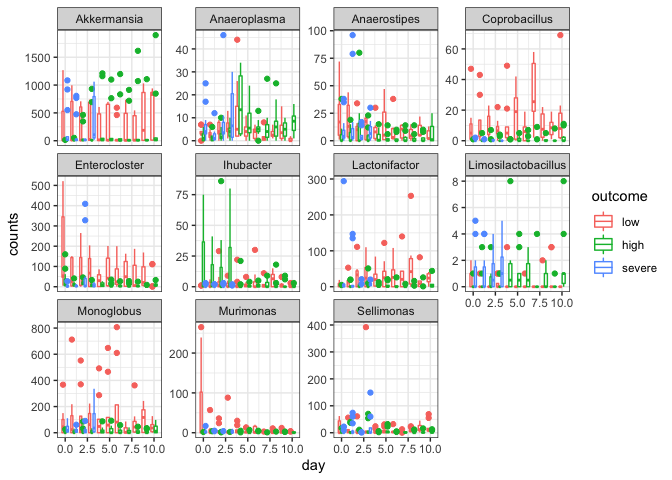<!-- --><!-- -->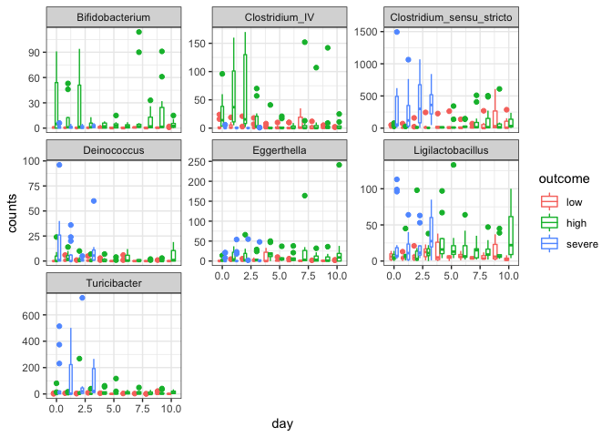<!-- -->

#### identify temporal patterns differentiating high/low clinical score

potential last figure or supplemental to show significant temporal
trends
